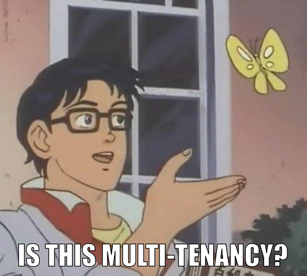

name: title
class: middle

# Yet another package for<br/>multi-tenancy in Django


Lorenzo Peña &middot; @lorinkoz

???

-   Salute, thank the audience for joining.
-   Who am I: name, city, profession, years of experience with Django.
-   Good wishes for EP2020

---

## 2020 is going great so far

.center[]

.bottom[
.footnote[This is arguably one of the most overused jokes of the year]
]

???

-   In what's probably the most overused joke of the year...

---

layout: true

## But so is Django <small>(no... seriously)</small>


---

---

-   15 years!

--

-   Mature, solid and battle tested.

--

-   Vast ecosystem - over 4k projects..ref[1]

.bottom[
.footnote[.ref[1] As listed in https://djangopackages.org]
]

---

-   Still a proud maker of magnificent monoliths.

--

-   Awesome community.

--

-   Great momentum.

---

-   Increasing async support.

--

-   Reactivity (not React) gaining some traction..ref[1].ref[2]

.bottom[
.footnote[.ref[1] https://github.com/edelvalle/reactor]
.footnote[.ref[2] https://github.com/jonathan-s/django-sockpuppet]
]

---

-   Yes, it scales!

--

-   Yes, you love it!

---

class: middle center
layout: false


### Django is in great shape for the starting decade

---

class: middle
layout: false

# Django and multi-tenancy

--

What does it have to do with .emph[you]?

---

## I have an hypothesis

--

The world is divided in two kinds of Djangonauts:

-   Those who **are doing** multi-tenancy.
-   Those who **will be doing** multi-tenancy anytime soon.

--

.box[🔥 Multi-tenancy is inevitable]

--

.box[🦉 You don't come to it, it comes to you]

???

Oportunity usually presents itself as:

-   Something that works good for a single tenant, and can be smartly expanded to a multi-tenant architecture
-   A million dollar idea for a SaaS.

So, my dear audience, if you're not doing multi-tenancy in Django right now, I suspect that the oportunity can be just around the corner. So be prepared!

---

class: middle center
layout: false



???

Now, before getting any deeper in the topic, and in case you're wondering what are we talking about, let's get on the same page on some definitions.

---

layout: true

## A tiny bit of theory

.bottom[
.footnote[.ref[1] https://en.wikipedia.org/wiki/Multitenancy]
]

---

**Multi-tenancy:** Software architecture in which a single instance of software runs on a server and serves multiple tenants..ref[1]

.right[]

---

**Tenant:** Group of users who share a common access with specific privileges to the software instance..ref[1]

.right[]

???

-   Private environment
-   In a running shared software
-   Where one or many users interact in isolation

---

layout: true

## Types of multi-tenancy

---

???

Now, the relationship between users and tenants delineates some types of multi-tenancy we should be aware of.

---

Users exist **outside** the context of tenants:

.center[]

---

Users exist **within** the context of tenants:

.center[]

---

Users exist **as** tenants:

.center[]

---

layout: false
class: middle center


???

How do we actually do this in Django?

[MEME]

Why?

-   Lots of things to do and do right.
-   Some of those things are non-trivial.

---

layout: true

## A package for multi-tenancy

---

.left-column[

-   There are multiple packages for handling multi-tenancy.
-   Yes, I made one of them<br/>(a fork, actually)
    ]

.right-column[
.right[]
]

???

Do you need a package as foundation for your multi-tenant project? Most likely yes!

--

.box[🦉 But none of them solves it all]

???

Because the topic is too complex and has many many sides.

---

.center[]

???

-   Let's pretend we're going to implement multi-tenancy from scratch.
-   You'll get a package, but not the one you can install.

---

<p>Tired:</p>

> Give someone a fish and you feed them for a day; teach someone to fish and you feed them for a lifetime.

???

Most likely you've heard of the proverb.

--

<p>Wired:</p>

> Give them a package for a SaaS and they will make it; teach them the underlying principles and they will break it.

???

Now, the equivalent of this proverb applied to multi-tenancy would be...

[WIRED]

I consider a good thing that you are capable of breaking your SaaS. Only doing that you'll be able to rebuild it better for the benefit of us all.

---

class: middle
layout: false

# The challenges ahead

???

Briefly mention the challenges ahead:

-   Active tenant
-   Database architecture
-   Routing requests
-   The scope of everything else

---

layout: true

## The active tenant

---

???

This takes a change of mindset.

---

.box[We need to know which tenant is **the active tenant** 😎]

--

.left-column[

-   Database access
-   URL reversing
-   Admin site
-   Cache
    ]

.right-column[

-   Channels (websockets)
-   Management commands
-   Celery tasks
-   File storage
    ]

--

.warning[👀 Even outside the request / response cycle]

---

Django has a couple APIs we're likely familiar with:

|             |                          |                      |
| ----------- | ------------------------ | -------------------- |
| 🌐 Timezone | `get_current_timezone()` | `activate(timezone)` |
| 🈸 Language | `get_current_language()` | `activate(language)` |

--

We could also have:

|           |                        |                    |
| --------- | ---------------------- | ------------------ |
| 🏠 Tenant | `get_current_tenant()` | `activate(tenant)` |

---

```python
# Drop-in replacement for threading.locals that works with asyncio
from asgiref.local import Local


_active = Local()

def get_current_tenant():
    return getattr(_active, "tenant", None)

def activate(tenant):
    _active.tenant = tenant
```

???

Here's a basic implementation example.

--

.warning[⚠️ The use of globals is generally discouraged]

???

Warning:

-   You shouldn't start creating globals for everything!
-   There is a reason why this pattern is so scarce in the Django codebase itself.
-   The more you depend on a global variable, the more coupled becomes your code, harder to test in isolation.
-   This would be an acceptable use case of an otherwise frowned upon pattern.

---

##### Two important questions to ask:

--

.box[What is the 🧪 **type** of a tenant object?]

--

.box[What happens if for some operation there is<br/>😶 **no active tenant**?]

???

We can discuss this later...

---

class: middle
layout: false

# Database, models and managers

???

Once that we have the concept of active tenant settled, it's time to move to one of the most interesting parts of multi-tenancy...

---

## Database architecture

--

**Isolated:**<br/>Multiple databases, one per tenant

**Shared:**<br/>One database, tenant column on entry-level tables

**Semi-isolated:**<br/>One database, one schema per tenant (PostgreSQL)

???

This is the common knowledge you get on most info about multi-tenancy out there.

---

layout: true

## Isolated databases

---

.center[]

???

One database for every tenant.

---

Multi-database configuration in Django settings:

```python
DATABASES = {
    "default": {...},
    "tenant1": {...},
    "tenant2": {...},
    "tenant3": {...},
    ...
}
```

---

Queries need to define the active tenant:

```python
tenant = get_current_tenant()
active_db = `get_database_for_tenant(tenant)`

customer = Customer(...)
customer.save(`using=active_db`)

Customer.objects.`using(active_db)`.filter(...)
Customer.objects.`db_manager(active_db)`.do_something(...)
```

--

.box[🙋 Do this allow for some automation?]

---

Django has a thing called database routers:

```python
class IsolatedTenantsRouter:

    def db_for_read(self, model, **hints):
        tenant = get_current_tenant()
        return `get_database_for_tenant(tenant)`

    def db_for_write(self, model, **hints):
        tenant = get_current_tenant()
        return `get_database_for_tenant(tenant)`
```

---

**.green[Benefits]**

-   Optimized for isolation.

**.red[Limitations]**

-   No cross-tenant relations.
-   No relations between tenants and shared data.
-   Adding tenants require reconfiguring the project.

---

.center[]

???

-   Increased costs of operations.
-   Scrooge McDuck might need to pay for your databases.

---

layout: true

## Shared database

---

.center[]

---

Entry-level, tenant-specific models require a FK to the model that controls the tenants:

```python
class SharedTenantAbstractModel(models.Model):

    tenant = models.ForeignKey("TenantModel", ...)

    class Meta:
        abstract = True
```

---

Assign the active tenant before creating a model instance:

```python
# Via model save
customer = Customer(...)
*customer.tenant = get_current_tenant()
customer.save()

# Via manager create
Customer.objects.create(`tenant=get_current_tenant()`, ...)
```

---

Scope the relevant queries with the active tenant:

```python
# In regular queries
Customer.objects.filter(`tenant=get_current_tenant()`, ...)
Order.objects.filter(`customer__tenant=get_current_tenant()`, ...)

# In related queries
some_product.orders.filter(`tenant=get_current_tenant()`, ...)
```

--

.box[🙋 Do this allow for some automation?]

---

Tenant field could be automatically **assigned** via:

-   Default value for the field (a callable).
-   `ForeignKey` field subclass with a `pre_save` hook.
-   `pre_save` signal on relevant models.

---

Tenant scope could be automatically **queried** via:

-   Custom manager.
-   Custom queries.

--

.warning[👀 Certain subqueries and aggregations might still require manual scoping]

---

**.green[Benefits]**

-   Optimized for scalability.

**.red[Limitations]**

-   Extra care to define tenant annotated models.
-   Extra care with tenant annotated queries.

---

.left-column[]

--

.right-column[

-   Bookmark all your tenant anotated queries.
-   Unit test each one of them.
-   Make the test suite fail if any query is untested.
    ]

--

.right-column[
.box[🧸 Tests are a soft pillow]
]

---

layout: true

## Semi-isolated database

---

.right[]

---

.left-column-66[Relies on PostgreSQL schemas.ref[1] to isolate tenants within a single database.
{{content}}]
.right-column-33[.right[]]

.bottom[
.footnote[.ref[1] https://www.postgresql.org/docs/9.1/ddl-schemas.html]
]

--

##### Schemas:

-   Layer between database and tables.
-   Equivalent to namespaces.

---

Search path defines the precedence of schemas:

.left-column-33[]
.right-column-66[{{content}}]

--

```psql
        SET search_path = tenant1, shared;
        SET search_path = tenant2, shared;
```

---

Your queries are always PODQ (plain old Django queries):

```python
Customer.objects.all()
Customer.objects.create(...)
```

--

.warning[👀 Increased technical challenge somewhere else!]

???

This is the hardest path to implement from scratch.

---

Requires a custom database backend in order to set `search_path` based on active tenant:

```python
from django.db.backends.postgresql import base as postgresql


class DatabaseWrapper(postgresql.DatabaseWrapper):
    def _cursor(self, name=None):  # Over simplified !!!
        cursor = super()._cursor(name=name)
        tenant = get_current_tenant()
        schemas = `get_schemas_from_tenant(tenant)`
        search_path = ",".join(schemas)
*       cursor.execute(f"SET search_path = {search_path}")
        return cursor
```

---

Requires a database router in order to control which models are migrated on which schemas:

```python
class SemiIsolatedTenantsRouter:
    def allow_migrate(self, db, app_label, model_name=None,
                      **hints):
        tenant = get_current_tenant()
        if tenant is not None:
            return `app_is_tenant_specific(app_label)`
        return `app_is_shared(app_label)`
```

???

This also implies that migrations can no longer be run project-wise, but on each schema.

---

**.green[Benefits]**

-   Optimized for isolation.
-   Allows relations between tenants and shared data.

**.red[Limitations]**

-   No cross tenant relations.
-   Extra care to define shared apps and tenant specific apps.
-   Extra care to define where to put users, sessions and ctypes.

---

.center[]

???

-   Migrations now must be run in all schemas.
-   It takes discipline to do zero downtime upgrades.

---

layout: true

## Which one is the best?

---

---

.warning[🔥 Neither!]

--

.left-column-66[But here's some food for thought...]
.right-column-33[.right[]]

???

We can discuss later...

---

|                       | Isolated | Shared | Semi-isolated |
| --------------------- | -------- | ------ | ------------- |
| Users inside tenants  | 🙂       | 🙂     | 🙂            |
| Users outside tenants | 😱       | 🙂     | 🤔😅          |
| Tenant isolation      | 😃       | 🤔😬   | 🤔😃          |
| Tenant aggregations   | 😬       | 😃     | 😬            |
| Database cost         | 🤑       | 🙂     | 🙂            |
| Database migrations   | 😅       | 😃     | 😅😬          |
| Overall scalability   | 😬       | 😃     | 🤨            |

---

class: middle
layout: false

# Requests and URL reversing

---

layout: true

## Activating a tenant from the incoming request

---

.left-column[

##### Captured in the request

-   Inferred from the user
-   Stored in the session
-   Specified in the headers
    ]

.right-column[

##### Captured in the URL

-   Via subdomain
-   Via subfolder
-   Via query parameter
    ]

--

.box[A tenant can be activated from an incoming request<br/>via 🚦 middleware]

---

```python
def TenantFromSessionMiddleware(get_response):
    def middleware(request):
        tenant = `get_tenant_from_session(request.session)`
        if tenant and not get_current_tenant():
            activate(tenant)
        return get_response(request)
    return middleware
```

--

.box[💡 Middleware with different retrieval methods<br/>can be chained]

---

.warning[⚠️ The order of middleware is important!]

--

.left-column[

.center[]

```python
SessionMiddleware
*TenantFromSessionMiddleware
AuthenticationMiddleware
*TenantFromUserMiddleware
```

]

--

.right-column[

.center[]

```python
*StandaloneTenantMiddleware
SessionMiddleware
AuthenticationMiddleware
```

]

---

layout: true

## Reversing tenant-aware URLs

---

--

.box[🙋‍♀️ How to reverse URLs so that the tenant is included?]

--

For some cases it's simply not possible:

|     |                          |
| --- | ------------------------ |
| ❌  | Inferred from the user   |
| ❌  | Stored in the session    |
| ❌  | Specified in the headers |

---

The only possible way is when the tenant is inferred from the URL itself:

|     |                     |                               |
| --- | ------------------- | ----------------------------- |
| ✔️  | Via subdomain       | `tenant1.example.com/view/`   |
| ✔️  | Via subfolder       | `example.com/tenant1/view/`   |
| ✔️  | Via query parameter | `example.com/view/?t=tenant1` |

--

.warning[👀 But some combinations are tricky]

---

**Via subdomain**<br/>
Django only reverses the path, so the full domain of the tenant must be prepended.

**Via subfolder**<br/>
All URLs must be interpolated with tenant. In order to make it URLConf transparent, a clever hack is required.

**Via query parameter**<br/>
All URLs must be appended with the query parameter.

---

layout: false

## Tenant-specific URLConfs

--

.box[💡 You can use different URLConfs based on the active tenant]

--

```python
def URLConfFromTenantMiddleware(get_response):
    def middleware(request):
        tenant = get_current_tenant()
*       request.urlconf = get_urlconf_from_tenant(tenant)
        return get_response(request)
    return middleware
```

---

class: middle
layout: false

# The scope of everything else

---

## Admin site

-   You may need custom admin sites for different tenants.
-   You can use custom model admins to provide tenant agnostic forms.

---

## Cache

You can define a tenant-specific cache key function:

```python
# settings.py
CACHES = {
    "default": {
        ...
        "KEY_FUNCTION": "myproject.cache.get_key_from_tenant",
    }
}

# myproject/cache.py
def get_key_from_tenant(key, key_prefix, version):
    tenant = get_current_tenant()
    return "{}:{}:{}:{}".format(tenant, key_prefix, version, key)
```

---

## Celery tasks

You can pass the tenant to activate as one of your task parameters:

```python
@app.task(bind=True)
def some_celery_task(self, tenant_id, ...):
    tenant = get_tenant_from_id(tenant_id)
    activate(tenant)
    ...
```

---

## Channels (websockets)

-   Requires custom middleware to activate tenant from request.
-   Requires naming your consumer groups including the tenant (for proper cross-tenant group isolation)

--

.warning[👀 This requires some boilerplate code]

---

## Management commands

-   For new commands, you can include a tenant argument.
-   For existing, non tenant-aware commands, you can define a .emph[special command wrapper].

--

.warning[⚠️ This gets trickier the more elegant]

---

## File storage

-   You can define a custom tenant storage that organizes files per tenant.
-   If cross-tenant file access is a security problem for you, you will need a custom view to act as proxy for files and decide if the incoming request has access to the requested file.

---

class: middle
layout: false

## 😅 Too much to cover!

---

class: middle
layout: false

# Finally, the fish

---

layout: true

## Available packages

---

Multi-tenancy grid of **djangopackages.org**

https://djangopackages.org/grids/g/multi-tenancy/

--

.warning[⚠️ Check activity and compatibility of packages]

--

.box[🙏 Add yours if it's not there]

---

##### Shared database

-   [citusdata/django-multitenant](https://github.com/citusdata/django-multitenant)
-   [raphaelm/django-scopes](https://github.com/raphaelm/django-scopes)

##### Semi-isolated database

-   [bernardopires/django-tenant-schemas](https://github.com/bernardopires/django-tenant-schemas)
-   [tomturner/django-tenants](https://github.com/tomturner/django-tenants)

???
Packages are opinionated, primarily from the database architecture, but also from tenant routing.

---

layout: false

## Want to contribute?

--

-   Testing things.
-   Creating issues.
-   Opening pull requests.

--

.box[⭐ Come, we need .emph[you]!]

.right[]

---

## And that's it!

##### We can keep in touch here:

|         |                                                    |
| ------- | -------------------------------------------------- |
| Twitter | [@lorinkoz](https://twitter.com/lorinkoz)          |
| GitHub  | [github.com/lorinkoz](https://github.com/lorinkoz) |
| Email   | [lorinkoz@gmail.com](mailto:lorinkoz@gmail.com)    |

##### Special thanks to:

Russell Keith-Magee, Raphael Michel, Orlando William

---

template: title
