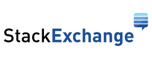
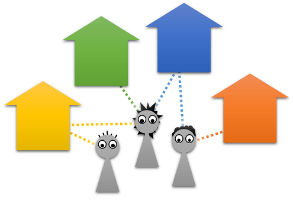
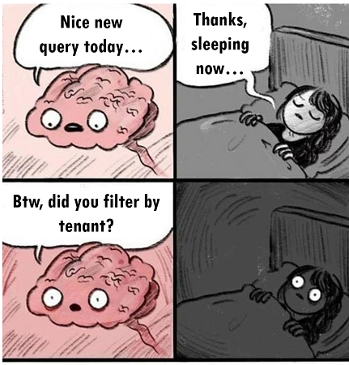

name: title
class: middle

# Yet another package for<br/>multi-tenancy in Django


Lorenzo Peña &middot; @lorinkoz

---

## 2020 is going great so far

.center[]

.bottom[
.footnote[This is arguably one of the most overused jokes of the year]
]

---

class: middle center
layout: false


### Django is in great shape for the starting decade

---

class: middle center
layout: false


---

layout: true

## Multi-tenancy

---

-   Customer .red[**red**] has a problem.

--

-   You develop a solution.

--

-   Everything works great!

--

-   Now customers .blue[**blue**], .green[**green**] and .yellow[**yellow**] have the same problem.

--

.box[🤔 What to do?]

---

.center[]

.bottom[
.footnote[Screenshot of https://store.steampowered.com/app/1291340/Townscaper/]
]

---

.center[]

.bottom[
.footnote[Screenshot of https://store.steampowered.com/app/1291340/Townscaper/]
]

---

.left-column-66[

-   Software architecture.
-   Single instance of code.
-   Serves multiple tenants.

]

.right-column-33[.right[]]

--


---

layout: true

## Tenants

---

.left-column-66[

-   Isolated space.
-   Users with specific privileges interact.

]
.right-column-33[
.right[]
]

---

.left-column-33[
.center[ Accounts]
]

.left-column-33[
.center[ Workspaces]
]

.left-column-33[
.center[ Blogs]
]

.left-column-33[
.center[ Servers]
]

.left-column-33[
.center[ Shops]
]

.left-column-33[
.center[ Sites]
]

---

layout: true

## Users and tenants

---

Users exist **outside** the context of tenants:

.left-column-66[
.left[]
]

--

.right-column-33[
.center[]
.center[]
.center[]
]

---

Users exist **within** the context of tenants:

.left-column-66[
.left[]
]

--

.right-column-33[
.center[]
]

---

Users exist **as** tenants:

.left-column-66[
.left[]
]

--

.right-column-33[
.center[]
.center[]
]

---

layout: false
class: middle center


---

layout: true

## A package for multi-tenancy

---

.left-column[

-   There are multiple packages for handling multi-tenancy.
-   Yes, I made one of them<br/>(a fork, actually)
    ]

.right-column[
.right[]
]

--

.box[🦉 But none of them solves it all]

---

.center[]

---

class: middle
layout: false

# The challenges ahead

---

layout: true

## The active tenant

---

.box[We need to know which tenant is **the active tenant** 😎]

--

.left-column[

-   Database access
-   URL reversing
-   Admin site
-   Cache
    ]

.right-column[

-   Channels (websockets)
-   Management commands
-   Celery tasks
-   File storage
    ]

--

.warning[👀 Even outside the request / response cycle]

---

Django has a couple APIs we're likely familiar with:

|             |                          |                      |
| ----------- | ------------------------ | -------------------- |
| 🌐 Timezone | `get_current_timezone()` | `activate(timezone)` |
| 🈸 Language | `get_current_language()` | `activate(language)` |

--

We could also have:

|           |                        |                    |
| --------- | ---------------------- | ------------------ |
| 🏠 Tenant | `get_current_tenant()` | `activate(tenant)` |

---

```python
# Drop-in replacement for threading.locals that works with asyncio
from asgiref.local import Local

_active = Local()

def get_current_tenant():
    return getattr(_active, "tenant", None)

def activate(tenant):
    _active.tenant = tenant
```

--

.warning[⚠️ The use of globals is generally discouraged]

---

##### Two important questions to ask:

--

.box[What is the 🧪 **type** of a tenant object?]

--

.box[What happens if for some operation there is<br/>😶 **no active tenant**?]

---

class: middle
layout: false

# Database, models and managers

---

## Database architecture

--

**Isolated:**<br/>Multiple databases, one per tenant

**Shared:**<br/>One database, tenant column on entry-level tables

**Semi-isolated:**<br/>One database, one schema per tenant (PostgreSQL)

---

layout: true

## Isolated databases

---

.center[]

---

Multi-database configuration in Django settings:

```python
DATABASES = {
    "default": {...},
    "tenant1": {...},
    "tenant2": {...},
    "tenant3": {...},
    ...
}
```

---

Queries need to rely on the active tenant:

```python
tenant = get_current_tenant()
active_db = `get_database_for_tenant(tenant)`

customer = Customer(...)
customer.save(`using=active_db`)

Customer.objects.`using(active_db)`.filter(...)
Customer.objects.`db_manager(active_db)`.do_something(...)
```

---

Scope could be offloaded to **database routers**:

```python
class IsolatedTenantsDatabaseRouter:

    def `db_for_read`(self, model, **hints):
        tenant = get_current_tenant()
        return `get_database_for_tenant(tenant)`

    def `db_for_write`(self, model, **hints):
        tenant = get_current_tenant()
        return `get_database_for_tenant(tenant)`
```

---

**.green[The good]**

-   Optimized for isolation.

**.red[The bad]**

-   No relations across databases.
-   Adding tenants require reconfiguring the project.

---

.center[]

---

layout: true

## Shared database

---

.center[]

---

.emph[Entry-level, tenant-specific models] require a pointer to the tenant they belong to:

```python
class SomeTenantSpecificModel(models.Model):

    tenant = models.ForeignKey("TenantModel", ...)

    # Rest of the model
    ...

```

---

Queries need to rely on the active tenant:

```python
tenant = get_current_tenant()

Customer.objects.create(`tenant=tenant`, ...)

Customer.objects.filter(`tenant=tenant`, ...)
Order.objects.filter(`customer__tenant=tenant`, ...)
some_product.orders.filter(`tenant=tenant`, ...)
```

---

Tenant field could be automatically **assigned** via:

-   Default value for the field (a callable).
-   Custom field (`ForeignKey` subclass) with a `pre_save` hook.
-   `pre_save` signal on relevant models.

--

Tenant scope could be automatically **queried** via:

-   Custom manager.
-   Custom queries.

---

**.green[The good]**

-   Optimized for scalability.

**.red[The bad]**

-   Data isolation takes extra effort.

---

.left-column[]

--

.right-column[

-   Bookmark all your tenant anotated queries.
-   Test each one of them.
-   Test that you tested each one of them.
    ]

--

.right-column[
.box[🧸 Tests are a soft pillow]
]

---

layout: true

## Semi-isolated database

---

.right[]

---

.left-column-66[Relies on PostgreSQL schemas.ref[1] to isolate tenants within a single database.
{{content}}]
.right-column-33[.right[]]

.bottom[
.footnote[.ref[1] https://www.postgresql.org/docs/9.1/ddl-schemas.html]
]

--

##### Schemas:

-   Layer between database and tables.
-   Equivalent to namespaces.
-   Searchable through the **search path**.

---

Your queries remain unchanged:

```python
Customer.objects.all()
Customer.objects.create(...)
```

--

.warning[👀 Increased technical challenge somewhere else!]

---

Requires a **custom database backend** in order to set the search path based on the active tenant:

```python
from django.db.backends.postgresql import base as postgresql


class DatabaseWrapper(postgresql.DatabaseWrapper):
    def _cursor(self, name=None):  # Over simplified !!!
        cursor = super()._cursor(name=name)
        tenant = get_current_tenant()
        schemas = `get_schemas_from_tenant(tenant)`
        search_path = ",".join(schemas)
*       cursor.execute(f"SET search_path = {search_path}")
        return cursor
```

---

Requires a **database router** in order to control which models are migrated on which schemas:

```python
class SemiIsolatedTenantsDatabaseRouter:

    def `allow_migrate`(self, db, app_label, model_name, ...):
        tenant = get_current_tenant()
        if tenant is not None:
            return `is_tenant_specific(app_label, model_name)`
        return not `is_tenant_specific(app_label, model_name)`
```

---

**.green[The good]**

-   Optimized for isolation with increased scalability.

**.red[The bad]**

-   Extra effort to understand and control how schemas interact.

---

.center[]

---

layout: true

## Which one is the best?

---

---

.warning[🔥 Neither!]

--

.left-column-66[

-   Pros and cons in all of them.
-   Depends on your specific use case.

]
.right-column-33[.right[]]

---

class: middle
layout: false

# Requests and URL reversing

---

layout: true

## Activating a tenant from the incoming request

---

.left-column[

##### Captured in the request

-   Inferred from the user
-   Stored in the session
-   Specified in the headers
    ]

.right-column[

##### Captured in the URL

-   Via subdomain
-   Via subfolder
-   Via query parameter
    ]

--

.box[A tenant can be activated from an incoming request<br/>via 🚦 middleware]

---

```python
def TenantFromSessionMiddleware(get_response):
    def middleware(request):
        tenant = `get_tenant_from_session(request.session)`
        if tenant and not get_current_tenant():
            activate(tenant)
        return get_response(request)
    return middleware
```

--

.box[💡 Middleware with different retrieval methods<br/>can be chained]

---

layout: true

## Reversing tenant-aware URLs

---

.box[🙋‍♀️ How to reverse URLs so that the tenant is included?]

--

For some cases it's simply not possible:

|     |                          |
| --- | ------------------------ |
| ❌  | Inferred from the user   |
| ❌  | Stored in the session    |
| ❌  | Specified in the headers |

---

The only possible way is when the tenant is inferred from the URL itself:

|     |                     |                                        |
| --- | ------------------- | -------------------------------------- |
| ✔️  | Via subdomain       | .emph[`tenant1`]`.example.com/view/`   |
| ✔️  | Via subfolder       | `example.com/`.emph[`tenant1`]`/view/` |
| ✔️  | Via query parameter | `example.com/view/?t=`.emph[`tenant1`] |

---

**Via subdomain**<br/>
Django only reverses the path, so the full domain of the tenant must be prepended.

**Via subfolder**<br/>
All URLs must be interpolated with the tenant. To make the subfolder transparent to the URLConf, a clever hack is required.

**Via query parameter**<br/>
All URLs must be appended with the query parameter.

---

layout: false

## Tenant-specific URLConfs

--

.box[💡 You can use different URLConfs based on the active tenant]

--

```python
def URLConfFromTenantMiddleware(get_response):
    def middleware(request):
        tenant = get_current_tenant()
*       request.urlconf = get_urlconf_from_tenant(tenant)
        return get_response(request)
    return middleware
```

---

class: middle
layout: false

# The scope of everything else

---

## Management commands

-   For new commands, you can include a tenant argument.
-   For existing, non tenant-aware commands, you can define a .emph[special command wrapper].

---

## File storage

-   You can define a custom tenant storage that organizes files per tenant.
-   If cross-tenant file access is a security problem for you, you will need a custom view to act as proxy for files and decide if the incoming request has access to the requested file.

---

## Cache

You can define a tenant-specific cache key function:

```python
# settings.py
CACHES = {
    "default": {
        ...
        "KEY_FUNCTION": "myproject.cache.get_key_from_tenant",
    }
}

# myproject/cache.py
def get_key_from_tenant(key, key_prefix, version):
    tenant = get_current_tenant()
    return "{}:{}:{}:{}".format(tenant, key_prefix, version, key)
```

---

## Celery tasks

You can pass the tenant to activate as one of your task parameters:

```python
@app.task(bind=True)
def some_celery_task(self, tenant_id, ...):
    tenant = get_tenant_from_id(tenant_id)
    activate(tenant)
    ...
```

---

## Channels (websockets)

-   Requires custom middleware to activate tenant from request.
-   Requires naming your consumer groups including the tenant (for proper cross-tenant group isolation)

---

class: middle
layout: false

## 😅 Too much to cover, huh?

---

layout: true

## The fish

---

##### Shared database

-   [citusdata/django-multitenant](https://github.com/citusdata/django-multitenant)
-   [raphaelm/django-scopes](https://github.com/raphaelm/django-scopes)

##### Semi-isolated database

-   [bernardopires/django-tenant-schemas](https://github.com/bernardopires/django-tenant-schemas)
-   [tomturner/django-tenants](https://github.com/tomturner/django-tenants)

---

layout: false

## Want to contribute?

--

-   Reporting bugs.
-   Proposing / implementing new features.
-   Improving documentation.

--

.box[⭐ Come, we need .emph[you]!]

.right[]

---

## And that's it!

##### We can keep in touch here:

|         |                                                    |
| ------- | -------------------------------------------------- |
| Twitter | [@lorinkoz](https://twitter.com/lorinkoz)          |
| GitHub  | [github.com/lorinkoz](https://github.com/lorinkoz) |
| Email   | [lorinkoz@gmail.com](mailto:lorinkoz@gmail.com)    |

##### Special thanks to:

Russell Keith-Magee, Raphael Michel, Orlando William

---

template: title
